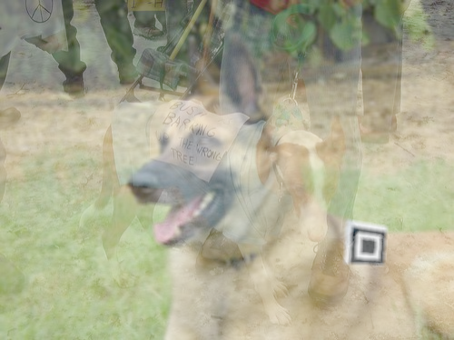

# Cascade Training for QR Code detection
This folder contains the python program I built to generate positive and negative image samples to then feed into the `opencv_traincascade` tool. If you just want to run the React App, you can find many pre-trained cascade files in the `public/cv` folder of this repo.

For background images, I used [Stanford's Dog Dataset](http://vision.stanford.edu/aditya86/ImageNetDogs/) which contains around 20,000 pictures.

The positive images add a warped QR code finding pattern onto the dog image, add blur and overlay another dog image with low opacity to simulate the reflection of a phone screen. For the corners, I assumed that the QR Code doesn't have a [quiet zone](https://en.wikipedia.org/wiki/QR_code#/media/File:QR_Code_Structure_Example_3.svg) which is why the FIPs in `./patterns` only have a white border to one side.

As negative samples, to teach the object detection to not return true inside the QR Code, I generated actual QR Codes and covered the corners. I projected these onto dog images as well.

## Example for a positive sample

## Commands
Commands for training. These tools come with OpenCV 3.x

### Create positive samples from images folder
`opencv_createsamples -info ./positive.txt -vec ./positive.vec -num 20000 -w 16 -h 16`

### Train model
`opencv_traincascade -data ./trainout -vec ./positive.vec -bg ./negative.txt -numPos 1000 -numNeg 1000 -numStages 20 -w 16 -h 16`